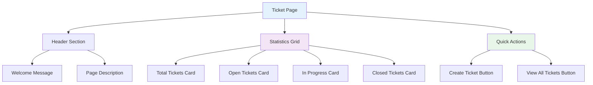
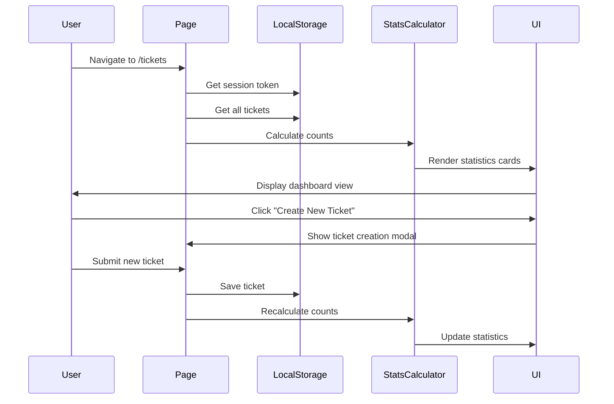

# Design Document

## Overview

The Ticket Page Redesign transforms the ticket management interface from a list-focused view into a dashboard-style overview page. The new design emphasizes visual clarity, quick information access, and intuitive navigation. By adopting the same clean aesthetic as the main dashboard, the redesigned ticket page provides a cohesive user experience while maintaining all core functionality for ticket management.

## Architecture

### Component Structure



### Data Flow



## Components and Interfaces

### 1. Page Header Component

**Purpose**: Display personalized greeting and page context

**Structure**:
```html
<div class="page-header">
  <h1 class="welcome-message">Welcome back, Demo User!</h1>
  <p class="page-description">Here's an overview of your ticket management system.</p>
</div>
```

**Styling**:
```css
.page-header {
  margin-bottom: 2rem;
}

.welcome-message {
  font-size: 2rem;
  font-weight: 700;
  color: #1a1a1a;
  margin-bottom: 0.5rem;
}

.page-description {
  font-size: 1rem;
  color: #666;
}
```

### 2. Statistics Card Component

**Purpose**: Display ticket counts with visual indicators

**Structure**:
```html
<div class="stat-card">
  <div class="stat-icon">
    <!-- SVG icon -->
  </div>
  <div class="stat-content">
    <div class="stat-label">Total Tickets</div>
    <div class="stat-value">4</div>
  </div>
</div>
```

**Card Variants**:
- **Total Tickets**: Gray document icon
- **Open Tickets**: Green circle icon
- **In Progress**: Amber circle icon
- **Closed Tickets**: Gray circle icon

**Styling**:
```css
.stat-card {
  background: white;
  border-radius: 12px;
  padding: 1.5rem;
  box-shadow: 0 1px 3px rgba(0, 0, 0, 0.1);
  display: flex;
  align-items: center;
  gap: 1rem;
  transition: box-shadow 0.2s ease;
}

.stat-card:hover {
  box-shadow: 0 4px 6px rgba(0, 0, 0, 0.1);
}

.stat-icon {
  width: 48px;
  height: 48px;
  border-radius: 50%;
  display: flex;
  align-items: center;
  justify-content: center;
  flex-shrink: 0;
}

.stat-content {
  flex: 1;
}

.stat-label {
  font-size: 0.875rem;
  color: #666;
  margin-bottom: 0.25rem;
}

.stat-value {
  font-size: 2rem;
  font-weight: 700;
  color: #1a1a1a;
}
```

### 3. Statistics Grid Component

**Purpose**: Organize statistics cards in responsive layout

**Structure**:
```html
<div class="stats-grid">
  <!-- Stat cards -->
</div>
```

**Responsive Behavior**:
```css
.stats-grid {
  display: grid;
  gap: 1.5rem;
  margin-bottom: 2rem;
}

/* Desktop: 4 columns */
@media (min-width: 1024px) {
  .stats-grid {
    grid-template-columns: repeat(4, 1fr);
  }
}

/* Tablet: 2 columns */
@media (min-width: 768px) and (max-width: 1023px) {
  .stats-grid {
    grid-template-columns: repeat(2, 1fr);
  }
}

/* Mobile: 1 column */
@media (max-width: 767px) {
  .stats-grid {
    grid-template-columns: 1fr;
  }
}
```

### 4. Quick Actions Component

**Purpose**: Provide primary action buttons for ticket management

**Structure**:
```html
<div class="quick-actions">
  <h2 class="section-title">Quick Actions</h2>
  <div class="action-buttons">
    <button class="action-btn primary" id="createTicketBtn">
      <svg><!-- Plus icon --></svg>
      Create New Ticket
    </button>
    <button class="action-btn secondary" id="viewAllTicketsBtn">
      <svg><!-- List icon --></svg>
      View All Tickets
    </button>
  </div>
</div>
```

**Styling**:
```css
.quick-actions {
  background: white;
  border-radius: 12px;
  padding: 2rem;
  box-shadow: 0 1px 3px rgba(0, 0, 0, 0.1);
}

.section-title {
  font-size: 1.25rem;
  font-weight: 600;
  color: #1a1a1a;
  margin-bottom: 1.5rem;
}

.action-buttons {
  display: flex;
  gap: 1rem;
  flex-wrap: wrap;
}

.action-btn {
  padding: 0.75rem 1.5rem;
  border-radius: 8px;
  font-weight: 500;
  display: flex;
  align-items: center;
  gap: 0.5rem;
  transition: all 0.2s ease;
  cursor: pointer;
  border: none;
}

.action-btn.primary {
  background: #3b82f6;
  color: white;
}

.action-btn.primary:hover {
  background: #2563eb;
}

.action-btn.secondary {
  background: #f3f4f6;
  color: #374151;
  border: 1px solid #e5e7eb;
}

.action-btn.secondary:hover {
  background: #e5e7eb;
}
```

## Data Models

### Statistics Data Structure

```javascript
const TicketStatistics = {
  total: 0,        // Total number of tickets
  open: 0,         // Count of Open tickets
  inProgress: 0,   // Count of In Progress tickets
  closed: 0        // Count of Closed tickets
};
```

### User Session Data

```javascript
const UserSession = {
  token: 'string',
  user: {
    id: 'string',
    username: 'string',  // Used for welcome message
    email: 'string'
  },
  expiresAt: 'timestamp'
};
```

## User Interface Design

### Color Palette

```css
:root {
  /* Background Colors */
  --bg-primary: #f9fafb;
  --bg-card: #ffffff;
  
  /* Text Colors */
  --text-primary: #1a1a1a;
  --text-secondary: #666666;
  
  /* Status Colors */
  --status-open: #10b981;
  --status-progress: #f59e0b;
  --status-closed: #6b7280;
  
  /* Action Colors */
  --action-primary: #3b82f6;
  --action-primary-hover: #2563eb;
  --action-secondary: #f3f4f6;
  --action-secondary-hover: #e5e7eb;
  
  /* Border Colors */
  --border-light: #e5e7eb;
  
  /* Shadow */
  --shadow-sm: 0 1px 3px rgba(0, 0, 0, 0.1);
  --shadow-md: 0 4px 6px rgba(0, 0, 0, 0.1);
}
```

### Icon Specifications

**Total Tickets Icon**:
```html
<svg width="24" height="24" viewBox="0 0 24 24" fill="none" stroke="#6b7280">
  <path stroke-linecap="round" stroke-linejoin="round" stroke-width="2" 
        d="M9 12h6m-6 4h6m2 5H7a2 2 0 01-2-2V5a2 2 0 012-2h5.586a1 1 0 01.707.293l5.414 5.414a1 1 0 01.293.707V19a2 2 0 01-2 2z"/>
</svg>
```

**Open Tickets Icon**:
```html
<div class="icon-circle" style="background: #10b981;">
  <svg width="16" height="16" viewBox="0 0 16 16" fill="white">
    <circle cx="8" cy="8" r="4"/>
  </svg>
</div>
```

**In Progress Icon**:
```html
<div class="icon-circle" style="background: #f59e0b;">
  <svg width="16" height="16" viewBox="0 0 16 16" fill="white">
    <circle cx="8" cy="8" r="4"/>
  </svg>
</div>
```

**Closed Tickets Icon**:
```html
<div class="icon-circle" style="background: #6b7280;">
  <svg width="16" height="16" viewBox="0 0 16 16" fill="white">
    <circle cx="8" cy="8" r="4"/>
  </svg>
</div>
```

### Layout Structure

```
┌─────────────────────────────────────────────────────────┐
│  Navigation Header                                       │
├─────────────────────────────────────────────────────────┤
│                                                          │
│  Welcome back, Demo User!                               │
│  Here's an overview of your ticket management system.   │
│                                                          │
│  ┌──────────┐  ┌──────────┐  ┌──────────┐  ┌──────────┐│
│  │ 📄       │  │ 🟢       │  │ 🟠       │  │ ⚫       ││
│  │ Total    │  │ Open     │  │ In Prog  │  │ Closed   ││
│  │ Tickets  │  │ Tickets  │  │          │  │ Tickets  ││
│  │    4     │  │    2     │  │    1     │  │    1     ││
│  └──────────┘  └──────────┘  └──────────┘  └──────────┘│
│                                                          │
│  ┌────────────────────────────────────────────────────┐ │
│  │ Quick Actions                                      │ │
│  │                                                    │ │
│  │  [+ Create New Ticket]  [📋 View All Tickets]    │ │
│  └────────────────────────────────────────────────────┘ │
│                                                          │
└─────────────────────────────────────────────────────────┘
```

## JavaScript Implementation

### Statistics Calculator Module

```javascript
class TicketStatisticsCalculator {
  constructor() {
    this.storageKey = 'tickets';
  }
  
  calculateStatistics() {
    const tickets = this.getTickets();
    
    return {
      total: tickets.length,
      open: tickets.filter(t => t.status === 'Open').length,
      inProgress: tickets.filter(t => t.status === 'In Progress').length,
      closed: tickets.filter(t => t.status === 'Closed').length
    };
  }
  
  getTickets() {
    try {
      const data = localStorage.getItem(this.storageKey);
      return data ? JSON.parse(data) : [];
    } catch (e) {
      console.error('Error reading tickets:', e);
      return [];
    }
  }
  
  updateStatisticsDisplay(stats) {
    document.getElementById('totalCount').textContent = stats.total;
    document.getElementById('openCount').textContent = stats.open;
    document.getElementById('inProgressCount').textContent = stats.inProgress;
    document.getElementById('closedCount').textContent = stats.closed;
  }
}
```

### Page Initialization

```javascript
class TicketPageController {
  constructor() {
    this.statsCalculator = new TicketStatisticsCalculator();
    this.authManager = new AuthManager();
  }
  
  init() {
    // Check authentication
    if (!this.authManager.isAuthenticated()) {
      window.location.href = '/auth/login';
      return;
    }
    
    // Display username
    this.displayUsername();
    
    // Calculate and display statistics
    this.refreshStatistics();
    
    // Attach event listeners
    this.attachEventListeners();
  }
  
  displayUsername() {
    const session = this.authManager.getSession();
    const username = session?.user?.username || 'User';
    document.getElementById('username').textContent = username;
  }
  
  refreshStatistics() {
    const stats = this.statsCalculator.calculateStatistics();
    this.statsCalculator.updateStatisticsDisplay(stats);
  }
  
  attachEventListeners() {
    document.getElementById('createTicketBtn')
      ?.addEventListener('click', () => this.handleCreateTicket());
    
    document.getElementById('viewAllTicketsBtn')
      ?.addEventListener('click', () => this.handleViewAllTickets());
  }
  
  handleCreateTicket() {
    // Show create ticket modal or navigate to creation page
    window.location.href = '/tickets/create';
  }
  
  handleViewAllTickets() {
    // Navigate to full ticket list view
    window.location.href = '/tickets/list';
  }
}

// Initialize on page load
document.addEventListener('DOMContentLoaded', () => {
  const controller = new TicketPageController();
  controller.init();
});
```

## Accessibility Considerations

### ARIA Labels

```html
<div class="stat-card" role="region" aria-label="Total tickets statistics">
  <div class="stat-icon" aria-hidden="true">
    <!-- Icon -->
  </div>
  <div class="stat-content">
    <div class="stat-label" id="totalLabel">Total Tickets</div>
    <div class="stat-value" id="totalCount" aria-labelledby="totalLabel">4</div>
  </div>
</div>
```

### Keyboard Navigation

```javascript
// Ensure all interactive elements are keyboard accessible
document.querySelectorAll('.action-btn').forEach(btn => {
  btn.setAttribute('tabindex', '0');
  
  btn.addEventListener('keydown', (e) => {
    if (e.key === 'Enter' || e.key === ' ') {
      e.preventDefault();
      btn.click();
    }
  });
});
```

### Focus Management

```css
.action-btn:focus-visible {
  outline: 2px solid #3b82f6;
  outline-offset: 2px;
}

.stat-card:focus-within {
  box-shadow: 0 0 0 3px rgba(59, 130, 246, 0.1);
}
```

## Performance Optimization

### Lazy Loading

```javascript
// Load statistics asynchronously
async function loadStatistics() {
  const stats = await new Promise(resolve => {
    setTimeout(() => {
      resolve(statsCalculator.calculateStatistics());
    }, 0);
  });
  
  statsCalculator.updateStatisticsDisplay(stats);
}
```

### CSS Optimization

```css
/* Use CSS containment for better rendering performance */
.stat-card {
  contain: layout style paint;
}

/* Use will-change for animated elements */
.action-btn {
  will-change: background-color, transform;
}
```

## Testing Strategy

### Unit Tests

```javascript
describe('TicketStatisticsCalculator', () => {
  it('should calculate correct total count', () => {
    const calculator = new TicketStatisticsCalculator();
    const stats = calculator.calculateStatistics();
    expect(stats.total).toBe(4);
  });
  
  it('should calculate correct status counts', () => {
    const calculator = new TicketStatisticsCalculator();
    const stats = calculator.calculateStatistics();
    expect(stats.open).toBe(2);
    expect(stats.inProgress).toBe(1);
    expect(stats.closed).toBe(1);
  });
});
```

### Integration Tests

```javascript
describe('Ticket Page Integration', () => {
  it('should display username from session', () => {
    const controller = new TicketPageController();
    controller.init();
    expect(document.getElementById('username').textContent).toBe('Demo User');
  });
  
  it('should navigate to create ticket on button click', () => {
    const controller = new TicketPageController();
    controller.init();
    document.getElementById('createTicketBtn').click();
    expect(window.location.href).toContain('/tickets/create');
  });
});
```

## Implementation Notes

1. **Reuse Existing Components**: Leverage the existing ticket creation modal and ticket list components
2. **Maintain Consistency**: Use the same color scheme and design patterns as the dashboard
3. **Progressive Enhancement**: Ensure the page works without JavaScript for basic viewing
4. **State Management**: Update statistics when returning from ticket creation/editing
5. **Error Handling**: Display friendly messages when localStorage is unavailable

This design provides a clean, intuitive interface that matches the dashboard aesthetic while maintaining all necessary functionality for ticket management.
