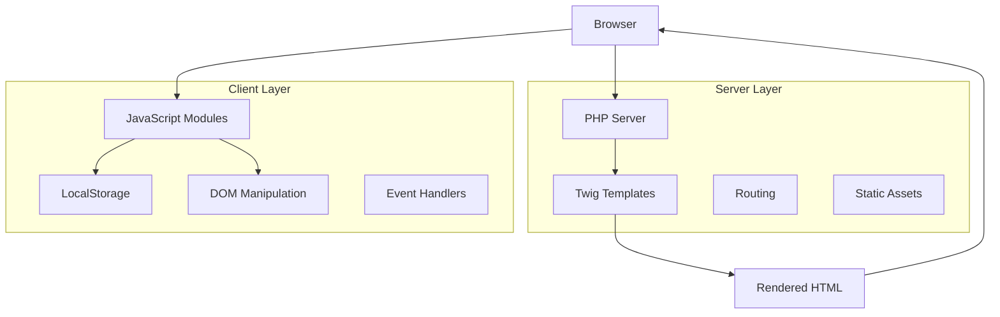

# Design Document

## Overview

The Twig-based Ticket Management Web App follows a hybrid architecture combining server-side rendering with progressive enhancement through vanilla JavaScript. The application leverages PHP with Twig templating for initial page rendering, while JavaScript modules handle dynamic interactions and localStorage-based state management. This approach ensures graceful degradation and optimal performance while maintaining rich user experience.

## Architecture

### High-Level Architecture



### Component Architecture

The application is structured into distinct layers:

1. **Server Layer**: PHP routing and Twig template rendering
2. **Presentation Layer**: HTML templates with semantic markup
3. **Enhancement Layer**: JavaScript modules for interactivity
4. **Data Layer**: LocalStorage for client-side persistence

## Components and Interfaces

### Server Components

#### 1. Router Component
- **Purpose**: Handle HTTP requests and route to appropriate templates
- **Technology**: PHP (Slim Framework recommended)
- **Routes**:
  - `GET /` → Landing page template
  - `GET /auth/login` → Login template
  - `GET /auth/signup` → Signup template
  - `GET /dashboard` → Dashboard template
  - `GET /tickets` → Ticket management template

#### 2. Template Engine
- **Purpose**: Render server-side HTML using Twig
- **Templates**:
  - `base.twig`: Base layout with head, navigation, footer
  - `landing.twig`: Hero section with SVG background
  - `auth/login.twig`: Login form template
  - `auth/signup.twig`: Signup form template
  - `dashboard.twig`: Statistics and navigation
  - `tickets.twig`: Ticket management interface

#### 3. Asset Manager
- **Purpose**: Serve static assets (CSS, JS, SVG)
- **Structure**:
  ```
  public/
  ├── assets/
  │   ├── hero-wave.svg
  │   ├── css/
  │   │   └── styles.css
  │   └── js/
  │       ├── auth.js
  │       ├── tickets.js
  │       └── utils.js
  ```

### Client Components

#### 1. Authentication Module (`auth.js`)
```javascript
class AuthManager {
  constructor() {
    this.tokenKey = 'ticketapp_session';
  }
  
  // Interface methods
  login(credentials) { /* Implementation */ }
  logout() { /* Implementation */ }
  isAuthenticated() { /* Implementation */ }
  redirectIfNotAuth() { /* Implementation */ }
}
```

#### 2. Ticket Management Module (`tickets.js`)
```javascript
class TicketManager {
  constructor() {
    this.storageKey = 'tickets';
    this.toastSystem = new ToastSystem();
  }
  
  // CRUD Interface
  createTicket(ticketData) { /* Implementation */ }
  getTickets() { /* Implementation */ }
  updateTicket(id, updates) { /* Implementation */ }
  deleteTicket(id) { /* Implementation */ }
  
  // UI Interface
  renderTickets() { /* Implementation */ }
  showCreateForm() { /* Implementation */ }
  showEditForm(id) { /* Implementation */ }
}
```

#### 3. Toast System Module (`utils.js`)
```javascript
class ToastSystem {
  show(message, type = 'info', duration = 3000) { /* Implementation */ }
  showSuccess(message) { /* Implementation */ }
  showError(message) { /* Implementation */ }
  showWarning(message) { /* Implementation */ }
}
```

## Data Models

### Ticket Entity
```javascript
const TicketSchema = {
  id: 'string', // UUID or timestamp-based
  title: 'string', // Required, max 100 characters
  description: 'string', // Optional, max 500 characters
  status: 'enum', // 'Open' | 'In Progress' | 'Closed'
  createdAt: 'timestamp',
  updatedAt: 'timestamp'
};
```

### Session Data
```javascript
const SessionSchema = {
  token: 'string', // Simulated JWT-like token
  user: {
    id: 'string',
    username: 'string',
    email: 'string'
  },
  expiresAt: 'timestamp'
};
```

### LocalStorage Structure
```javascript
// Storage keys and structure
localStorage = {
  'ticketapp_session': JSON.stringify(SessionSchema),
  'tickets': JSON.stringify([TicketSchema, ...]),
  'app_settings': JSON.stringify({
    theme: 'light',
    language: 'en'
  })
};
```

## User Interface Design

### Design System

#### Color Palette
```css
:root {
  /* Status Colors */
  --status-open: #10B981; /* Green */
  --status-progress: #F59E0B; /* Amber */
  --status-closed: #6B7280; /* Gray */
  
  /* UI Colors */
  --primary: #3B82F6;
  --secondary: #64748B;
  --background: #F8FAFC;
  --surface: #FFFFFF;
  --text-primary: #1E293B;
  --text-secondary: #64748B;
  
  /* Interactive */
  --hover: #F1F5F9;
  --focus: #3B82F6;
  --error: #EF4444;
  --success: #10B981;
}
```

#### Typography Scale
```css
.text-xs { font-size: 0.75rem; }
.text-sm { font-size: 0.875rem; }
.text-base { font-size: 1rem; }
.text-lg { font-size: 1.125rem; }
.text-xl { font-size: 1.25rem; }
.text-2xl { font-size: 1.5rem; }
.text-3xl { font-size: 1.875rem; }
```

#### Component Styles
```css
/* Card Component */
.card {
  background: var(--surface);
  border-radius: 0.5rem;
  box-shadow: 0 1px 3px rgba(0, 0, 0, 0.1);
  padding: 1.5rem;
}

/* Button Component */
.btn {
  padding: 0.5rem 1rem;
  border-radius: 0.375rem;
  font-weight: 500;
  transition: all 0.2s;
}

.btn-primary {
  background: var(--primary);
  color: white;
}

.btn-primary:hover {
  background: #2563EB;
}
```

### Page Layouts

#### Landing Page Layout
```html
<div class="min-h-screen bg-gradient-to-br from-blue-50 to-indigo-100">
  <header class="navigation">
    <!-- Logo and auth links -->
  </header>
  
  <main class="hero-section">
    <div class="hero-background">
      <!-- SVG wave background -->
    </div>
    <div class="hero-content">
      <!-- Title, description, CTA -->
    </div>
    <div class="decorative-elements">
      <!-- Floating circles -->
    </div>
  </main>
</div>
```

#### Dashboard Layout
```html
<div class="dashboard-container">
  <header class="dashboard-header">
    <!-- User info, logout -->
  </header>
  
  <main class="dashboard-content">
    <div class="stats-grid">
      <!-- Ticket statistics cards -->
    </div>
    <div class="quick-actions">
      <!-- Navigation to ticket management -->
    </div>
  </main>
</div>
```

#### Ticket Management Layout
```html
<div class="ticket-management">
  <header class="page-header">
    <!-- Title, create button -->
  </header>
  
  <div class="ticket-controls">
    <!-- Filters, search, sort -->
  </div>
  
  <div class="ticket-grid" id="ticketContainer">
    <!-- Dynamic ticket cards -->
  </div>
  
  <div class="modals">
    <!-- Create/Edit forms -->
  </div>
</div>
```

## Error Handling

### Client-Side Error Handling Strategy

#### 1. Authentication Errors
```javascript
// Error scenarios and handling
const AuthErrors = {
  INVALID_CREDENTIALS: 'Invalid username or password',
  SESSION_EXPIRED: 'Your session has expired. Please log in again.',
  NETWORK_ERROR: 'Unable to connect. Please check your internet connection.',
  STORAGE_ERROR: 'Unable to save session data. Please check browser settings.'
};

// Error handling implementation
class AuthErrorHandler {
  handle(error) {
    switch(error.type) {
      case 'INVALID_CREDENTIALS':
        this.showFieldError('password', AuthErrors.INVALID_CREDENTIALS);
        break;
      case 'SESSION_EXPIRED':
        this.clearSession();
        this.redirectToLogin(AuthErrors.SESSION_EXPIRED);
        break;
      default:
        this.showToast(error.message, 'error');
    }
  }
}
```

#### 2. CRUD Operation Errors
```javascript
const CRUDErrors = {
  VALIDATION_FAILED: 'Please check the form fields and try again',
  STORAGE_FULL: 'Storage limit reached. Please delete some tickets.',
  NETWORK_TIMEOUT: 'Operation timed out. Please try again.',
  UNKNOWN_ERROR: 'An unexpected error occurred. Please refresh and try again.'
};

class CRUDErrorHandler {
  handleValidation(errors) {
    errors.forEach(error => {
      this.highlightField(error.field);
      this.showFieldError(error.field, error.message);
    });
  }
  
  handleStorage(error) {
    if (error.code === 'QUOTA_EXCEEDED') {
      this.showToast(CRUDErrors.STORAGE_FULL, 'warning');
    }
  }
}
```

#### 3. Graceful Degradation
```javascript
// Feature detection and fallbacks
class FeatureDetection {
  hasLocalStorage() {
    try {
      localStorage.setItem('test', 'test');
      localStorage.removeItem('test');
      return true;
    } catch (e) {
      return false;
    }
  }
  
  hasJavaScript() {
    return typeof window !== 'undefined';
  }
  
  initializeFallbacks() {
    if (!this.hasLocalStorage()) {
      // Use session storage or cookies as fallback
      this.initializeSessionFallback();
    }
  }
}
```

## Testing Strategy

### Unit Testing Approach

#### 1. JavaScript Module Testing
```javascript
// Test structure for auth.js
describe('AuthManager', () => {
  beforeEach(() => {
    localStorage.clear();
    this.authManager = new AuthManager();
  });
  
  describe('login', () => {
    it('should store session token on successful login', () => {
      // Test implementation
    });
    
    it('should throw error on invalid credentials', () => {
      // Test implementation
    });
  });
  
  describe('isAuthenticated', () => {
    it('should return true when valid token exists', () => {
      // Test implementation
    });
    
    it('should return false when token is expired', () => {
      // Test implementation
    });
  });
});
```

#### 2. Ticket Management Testing
```javascript
describe('TicketManager', () => {
  describe('createTicket', () => {
    it('should validate required fields', () => {
      // Test validation logic
    });
    
    it('should generate unique IDs', () => {
      // Test ID generation
    });
    
    it('should persist to localStorage', () => {
      // Test storage operations
    });
  });
  
  describe('updateTicket', () => {
    it('should update existing ticket properties', () => {
      // Test update logic
    });
    
    it('should maintain data integrity', () => {
      // Test data consistency
    });
  });
});
```

### Integration Testing

#### 1. End-to-End User Flows
```javascript
// Test complete user journeys
describe('User Authentication Flow', () => {
  it('should complete login to dashboard journey', () => {
    // 1. Visit landing page
    // 2. Navigate to login
    // 3. Submit credentials
    // 4. Verify dashboard access
    // 5. Verify session persistence
  });
});

describe('Ticket Management Flow', () => {
  it('should complete CRUD operations', () => {
    // 1. Create new ticket
    // 2. Verify in ticket list
    // 3. Edit ticket details
    // 4. Update status
    // 5. Delete ticket
    // 6. Verify removal
  });
});
```

#### 2. Browser Compatibility Testing
- Test across modern browsers (Chrome, Firefox, Safari, Edge)
- Verify localStorage functionality
- Test responsive design breakpoints
- Validate accessibility features

### Performance Testing

#### 1. Load Time Optimization
- Measure initial page load times
- Test asset loading performance
- Verify JavaScript module loading
- Monitor localStorage operation speed

#### 2. Memory Usage Testing
- Monitor JavaScript memory consumption
- Test localStorage usage limits
- Verify proper cleanup on logout
- Check for memory leaks in long sessions

## Security Considerations

### Client-Side Security

#### 1. Data Validation
```javascript
class Validator {
  validateTicket(data) {
    const errors = [];
    
    // Title validation
    if (!data.title || data.title.trim().length === 0) {
      errors.push({ field: 'title', message: 'Title is required' });
    }
    
    if (data.title && data.title.length > 100) {
      errors.push({ field: 'title', message: 'Title must be less than 100 characters' });
    }
    
    // Status validation
    const validStatuses = ['Open', 'In Progress', 'Closed'];
    if (!validStatuses.includes(data.status)) {
      errors.push({ field: 'status', message: 'Invalid status value' });
    }
    
    // Description validation
    if (data.description && data.description.length > 500) {
      errors.push({ field: 'description', message: 'Description must be less than 500 characters' });
    }
    
    return errors;
  }
}
```

#### 2. XSS Prevention
```javascript
class SecurityUtils {
  sanitizeInput(input) {
    const div = document.createElement('div');
    div.textContent = input;
    return div.innerHTML;
  }
  
  escapeHtml(text) {
    const map = {
      '&': '&amp;',
      '<': '&lt;',
      '>': '&gt;',
      '"': '&quot;',
      "'": '&#039;'
    };
    
    return text.replace(/[&<>"']/g, (m) => map[m]);
  }
}
```

#### 3. Session Management
```javascript
class SessionManager {
  constructor() {
    this.tokenKey = 'ticketapp_session';
    this.maxAge = 24 * 60 * 60 * 1000; // 24 hours
  }
  
  isTokenValid(token) {
    try {
      const session = JSON.parse(token);
      const now = Date.now();
      return session.expiresAt > now;
    } catch (e) {
      return false;
    }
  }
  
  refreshToken() {
    const session = this.getSession();
    if (session) {
      session.expiresAt = Date.now() + this.maxAge;
      this.setSession(session);
    }
  }
}
```

## Implementation Notes

### Development Setup
1. **PHP Server**: Use built-in PHP server for development (`php -S localhost:8000 -t public`)
2. **Twig Installation**: Install via Composer (`composer require twig/twig`)
3. **Asset Pipeline**: Use simple file serving for development, consider build tools for production
4. **Hot Reloading**: Implement file watching for template changes during development

### Production Considerations
1. **Caching**: Implement Twig template caching for production
2. **Asset Optimization**: Minify CSS and JavaScript files
3. **CDN Integration**: Serve static assets from CDN
4. **Error Logging**: Implement server-side error logging
5. **Security Headers**: Add appropriate security headers for production deployment

This design provides a solid foundation for implementing the Twig-based Ticket Management Web App while maintaining consistency with the React and Vue versions, ensuring optimal performance, and providing excellent user experience across all scenarios.